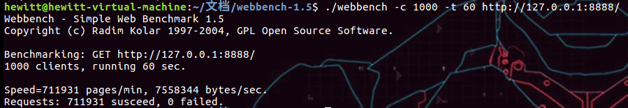
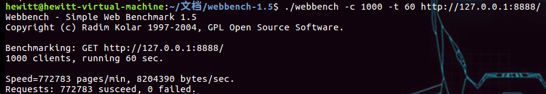

## 并发测试

---

#### 1、测试环境
- 测试环境：笔记本虚拟机设置为4核心，本地，CPU信息如下
- 测试工具：webbench，1000并发连接，时间60s

#### 2、测试结果
- 线程池大小为4

- 线程池大小为3

- 可以看到线程池大小为4的成功请求数还略有下降，因为线程池外的主线程同样在工作，此时工作线程为5，而核心数为4.
- 当线程池设置为3线程，此时工作线程为4，等同于核心数，此时性能有明显提升。
